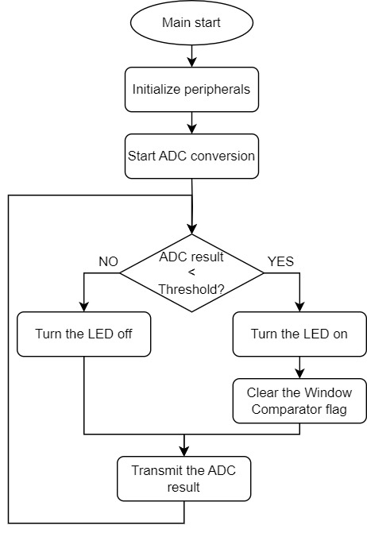
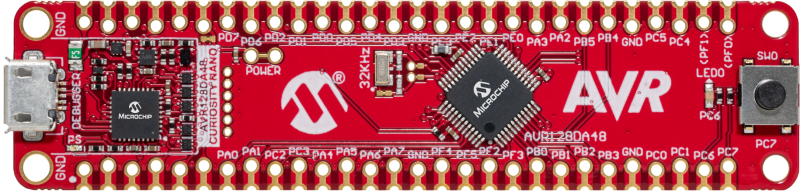
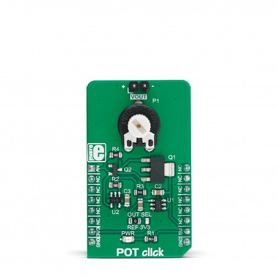
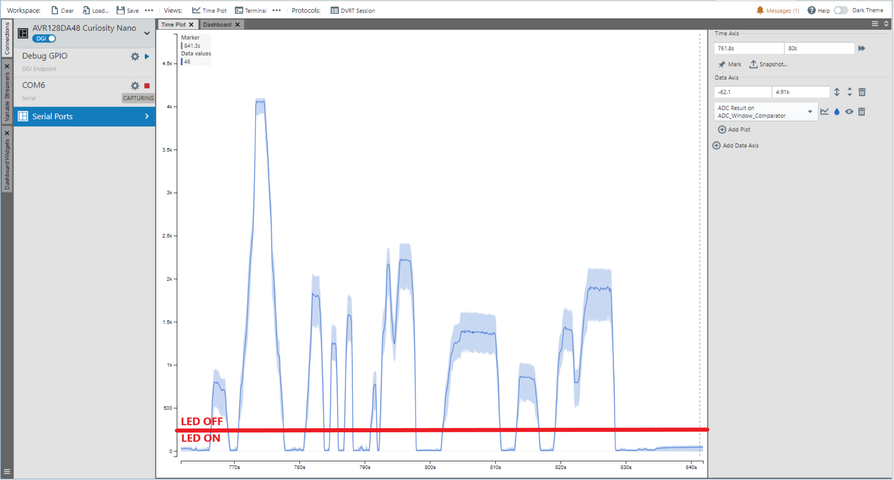
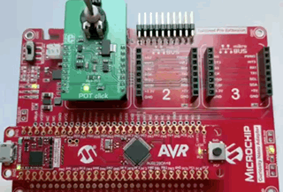
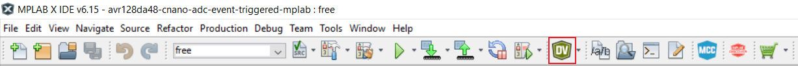
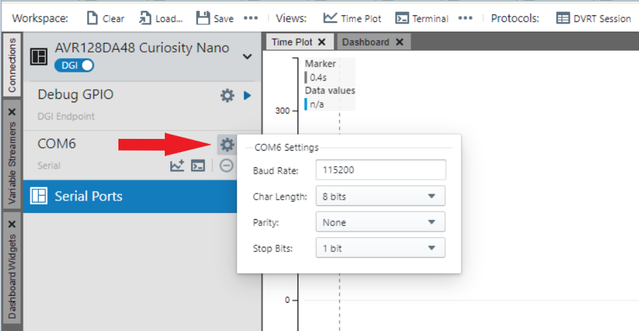
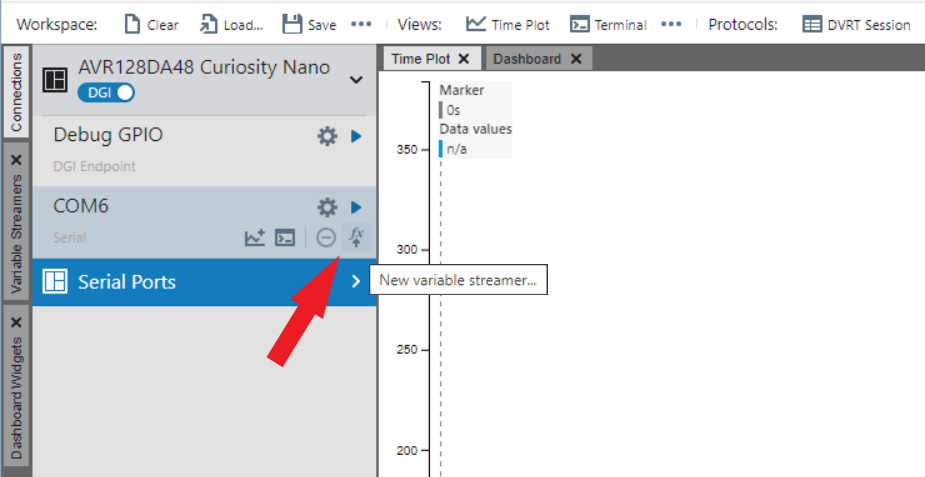
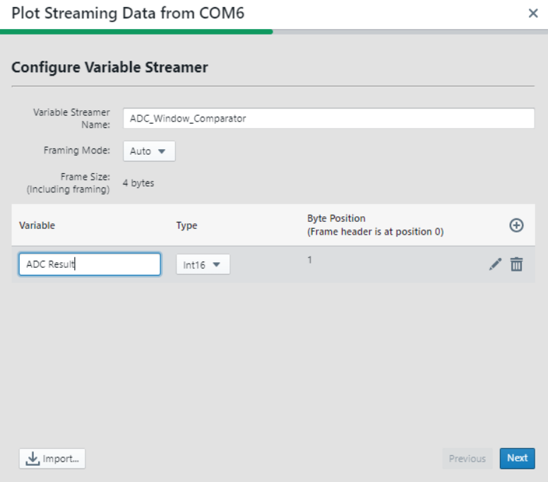
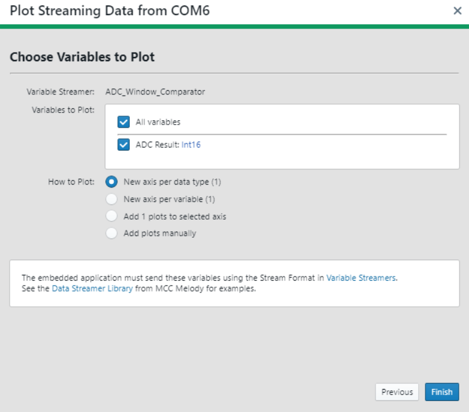

 
 
# Analog-to-Digital Converter (ADC) — Window Comparator Using the AVR128DA48 Microcontroller

This project implements an algorithm to display the data received from the device ADC peripheral using the Data Visualizer tool. The Window Comparator feature of the ADC is used to turn an LED on and off. When the results are below a defined threshold, the LED will be turned on. Otherwise, it will be turned off. The conversion results will be transmitted through the Universal Synchronous Asynchronous Receiver Transmitter (USART). The figure below presents the software diagram of this application.  
 

## Related Documentation

- [AVR128DA48 Data Sheet](http://ww1.microchip.com/downloads/en/DeviceDoc/40002183A.pdf)
- [AVR128DA48 Product Family Page](https://www.microchip.com/design-centers/8-bit/avr-mcus/device-selection/avr-da)
- [Using 12-Bit ADC for Conversions, Accumulation, and Triggering Events](https://www.microchip.com/wwwappnotes/appnotes.aspx?appnote=en1001530)

## Software Used

- [MPLAB® X IDE](http://www.microchip.com/mplab/mplab-x-ide) v6.15 or newer
- [MPLAB® XC8](http://www.microchip.com/mplab/compilers) v2.45 or newer
- [MPLAB® Data Visualizer](https://www.microchip.com/en-us/tools-resources/debug/mplab-data-visualizer) v1.3.1332 or newer
- [AVR®-Dx Device Family Pack](https://packs.download.microchip.com/) v2.3.272 or newer

## Hardware Used

- The [AVR128DA48 Curiosity Nano Development board](https://www.microchip.com/Developmenttools/ProductDetails/DM164151) is used as a test platform:
 

- [Curiosity Nano Base for Click Boards™](https://www.microchip.com/en-us/development-tool/AC164162):
   

- [POT Click board](https://www.mikroe.com/pot-click) (mikroBUS™ socket 1):
   

## Operation

To program the Curiosity Nano board with this MPLAB X project, follow the steps provided in the [How to Program the Curiosity Nano Board](#how-to-program-the-curiosity-nano-board) chapter.  

## Setup

The Curiosity Nano Base for Click boards is used to integrate the POT Click board.

 The following configurations must be made:

|Pin           | Configuration      |
| :----------: | :----------------: |
|PD3 (AIN3)    | Analog input       |
|PC0 (TX)      | Digital output     |
|PC6 (LED0)    | Digital output     |

## Demo

To observe the results plotted on a graph, follow the steps provided in the [How to Use the Data Visualizer](#how-to-use-the-data-visualizer) chapter.

After starting the application, rotate the potentiometer on the POT Click board to get the ADC result plotted on the graph.
 

The LED will turn on and off:
 

## Summary 

This application showcases the Window Comparator feature of the ADC. 

##  How to Program the Curiosity Nano board

This chapter shows how to use the MPLAB X IDE to program an AVR device with an `Example_Project.X`. This can be applied for any other projects. 

1. Connect the board to the PC.

2. Open the `Example_Project.X` project in MPLAB X IDE.

3. Set the `Example_Project.X` project as main project:
   Right click the project in the **Projects** tab and click Set as Main Project.
   

4. Clean and build the `Example_Project.X` project:
   Right click the `Example_Project.X` project and select Clean and Build.
   

5. Select AVRxxxxx Curiosity Nano in the Connected Hardware Tool section of the project settings:
   Right click the project and click Properties.
   Click the arrow under the Connected Hardware Tool.
   Select the AVRxxxxx Curiosity Nano by clicking on the SN.
   Click **Apply** and then **OK**.
   

6. Program the project to the board:
   Right click the project and then Make and Program Device.
   

 

## How to Use the Data Visualizer

1. Open the Data Visualizer:
 

2. In the Curiosity Nano COMn section, click the **Source options** button and set the Baud Rate:
 

3. From the same tab, select **New variable streamer**:
 

4. Configure the Variable Streamer Name and add the desired variable, then click **Next**:
 

5. Select all the variables to plot, check New axis per data type and click **Finish**:
 

 

- [Back to Top](#analog-to-digital-converter-adc--window-comparator-using-the-avr128da48-microcontroller)
- [Back to Setup](#setup)
- [Back to Demo](#demo)
- [Back to Summary](#summary)
