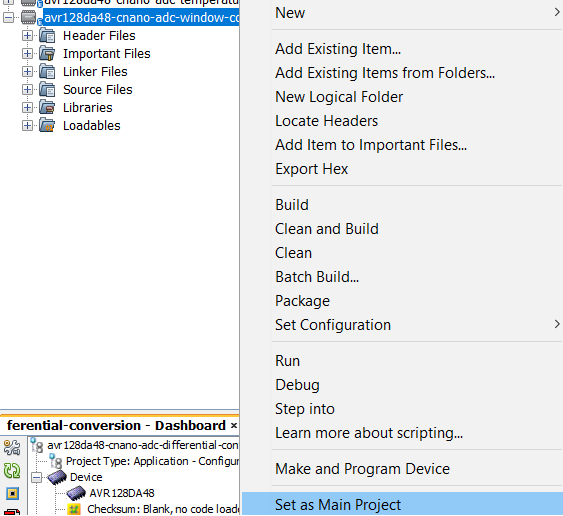
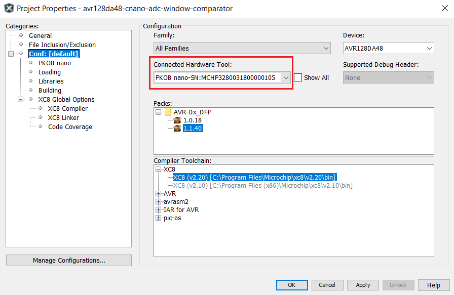
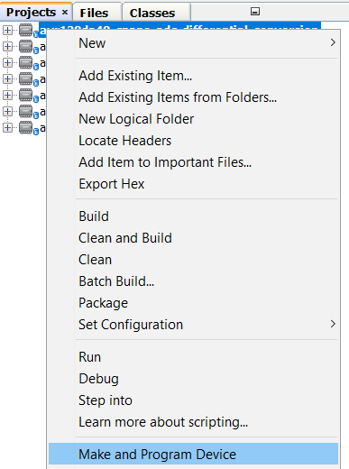
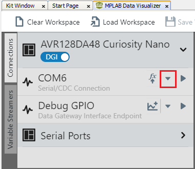
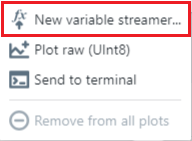
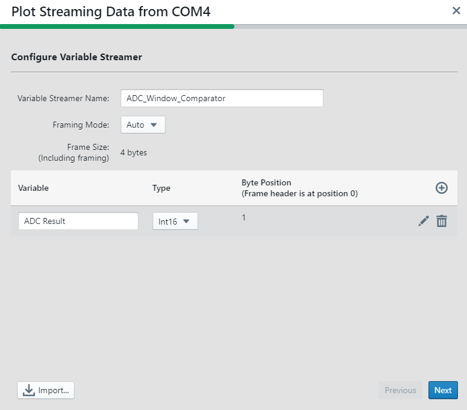
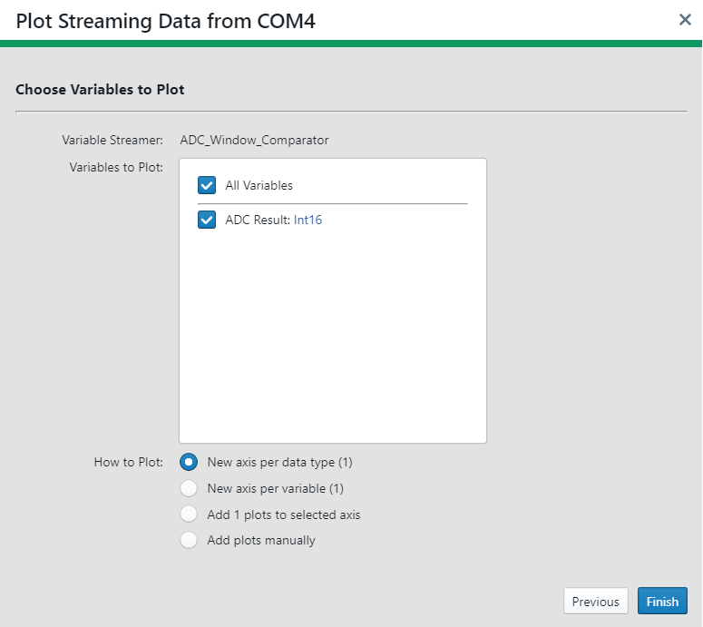
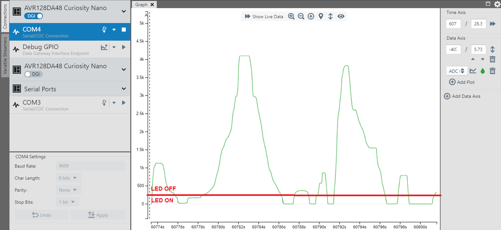

 <article class="markdown-body entry-content p-3 p-md-6" itemprop="This needs to locked down and 'never' changed">

 
# AVR128DA48 ADC Window Comparator

## Objective

In this application, Window Comparator feature will be used. When the results are below a defined threshold, the LED will be turned on. Otherwise, it will be turned off. The conversion results will be transmitted through USART.
The software diagram of this application is presented in the figure below.
 

## Related Documentation

- [Using 12-Bit ADC for Conversions, Accumulation, and Triggering Events](https://www.microchip.com/wwwappnotes/appnotes.aspx?appnote=en1001530)
- [AVR128DA48 Product Family Page](https://www.microchip.com/design-centers/8-bit/avr-mcus/device-selection/avr-da)
- [AVR128DA48 Data Sheet](http://ww1.microchip.com/downloads/en/DeviceDoc/40002183A.pdf)

## Software Used

- MPLAB® X IDE 5.40 or newer [(microchip.com/mplab/mplab-x-ide)](http://www.microchip.com/mplab/mplab-x-ide)
- MPLAB® XC8 2.20 or newer compiler [(microchip.com/mplab/compilers)](http://www.microchip.com/mplab/compilers)
- MPLAB® Data Visualizer plugin 1.1 
- AVR-Dx_DFP 1.4.75

## Hardware Used

- AVR128DA48 Curiosity Nano [(DM164151)](https://www.microchip.com/DevelopmentTools/ProductDetails/PartNO/DM164151)
- Curiosity Nano Base for Click boards™ [(AC164162)](https://www.microchip.com/developmenttools/ProductDetails/AC164162)
- One POT click board

## Setup

The AVR128DA48 Curiosity Nano Development Board is used as the test platform. To integrate the POT Click board, the Curiosity Nano Base for Click boards is used.

 The following configurations must be made:

|Pin           | Configuration      |
| :----------: | :----------------: |
|PD3 (AIN3)    | Analog Input       |
|PC0 (TX)      | Digital Output     |
|PC6 (LED0)    | Digital Output     |

## Operation

1. Connect the board to the PC.

2. Open the *avr128da48-cnano-adc-window-comparator.X* project in MPLAB® X IDE.

3. Set *avr128da48-cnano-adc-window-comparator.X* project as main project. Right click on the project in the *Projects* tab and click *Set as Main Project*:

 

4. Select the AVR128DA48 Curiosity Nano in the *Connected Hardware Tool* drop down list of the project settings:
  - Right click on the project and click *Properties*;
  - Select the AVR128DA48 Curiosity Nano (click on the SN) in the *Connected Hardware Tool* list and then click *OK*:

 

5. Program the project to the board: right click on the project and click *Make and Program Device*:

 

6. Open the Data Visualizer
 
   - From the Curiosity Nano COMn port, open the drop down list:
 
   - From the drop down list, select New variable streamer...:
 
   - Configure the Variable Streamer Name and add the desired variable, then click Next:
 
   - Select all the variables to plot, select New axis per data type, and click Finish:
 

Result:

Rotating the Potentiometer on the POT click board (after starting the application), the ADC result will be plotted on the graph:
 

The LED will turn on and off:
 

## Summary 

This application showcases the window comparator feature of the ADC. 